# HireHub — Job Board Website

<div align="center">


**A full-stack AI-powered job board platform with a job seeker app and an admin backoffice.**

[Job App (Live)](https://job-app-main-i5r2g4.laravel.cloud) · [Backoffice (Live)](https://job-backoffice-main-ifnmw3.laravel.cloud)

</div>

---

## Overview

HireHub is a modern job board web application built with Laravel 12. It consists of three repositories working together:

| Repo | Description |
|------|-------------|
| [`job-app`](https://github.com/Abdulrahman1Fiqi/Job-Board-Website) | Job seeker facing application |
| [`job-backoffice`](https://github.com/Abdulrahman1Fiqi/Job-Board-Website) | Admin & company owner dashboard |
| [`job-shared`](https://github.com/Abdulrahman1Fiqi/Job-Board-Website) | Shared Eloquent models package used by both apps |

---

## Features

### Job App (Job Seeker)
- Browse and search job vacancies with filters (Full-time, Remote, Hybrid, Contract)
- View detailed job listings with salary, location, and company info
- Apply to jobs by uploading a PDF resume or selecting an existing one
- AI-powered resume scoring and feedback using Claude AI
- Track application status (pending / accepted / rejected) with AI feedback
- User authentication (register, login, remember me)

### Backoffice (Admin / Company Owner)
- Analytics dashboard with active users, total jobs, total applications
- Most applied jobs and conversion rate tracking
- Full CRUD for Companies, Job Vacancies, Job Categories, Job Applications, and Users
- Soft delete (archive/restore) for all entities
- Role-based access control (admin, company-owner, job-seeker)

---

## Screenshots

### Job App

#### Landing Page
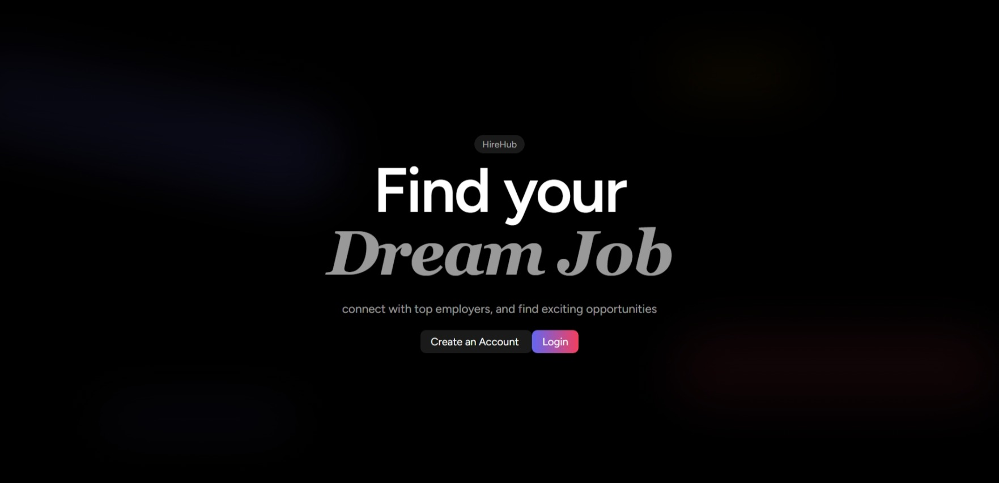

#### Job Listings Dashboard
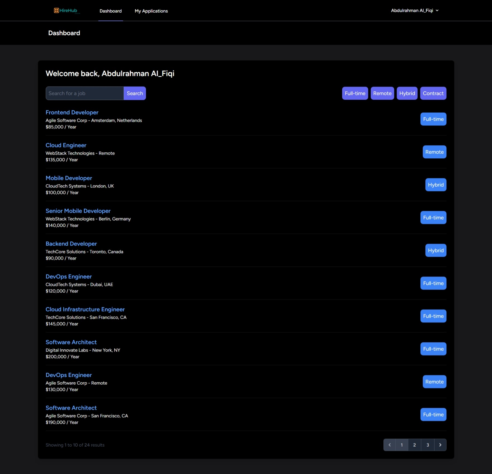

#### Job Details
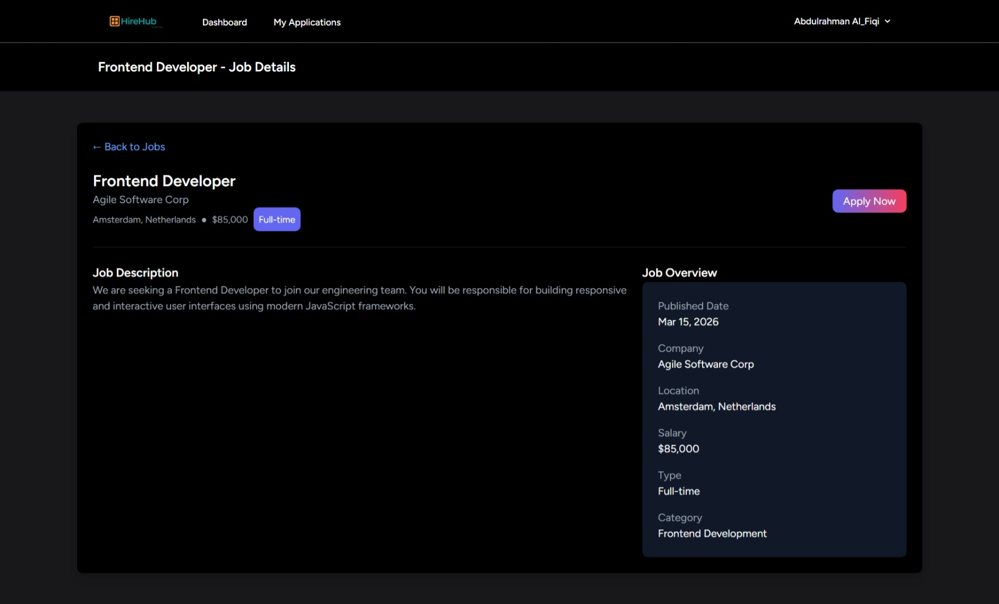

#### Apply for a Job
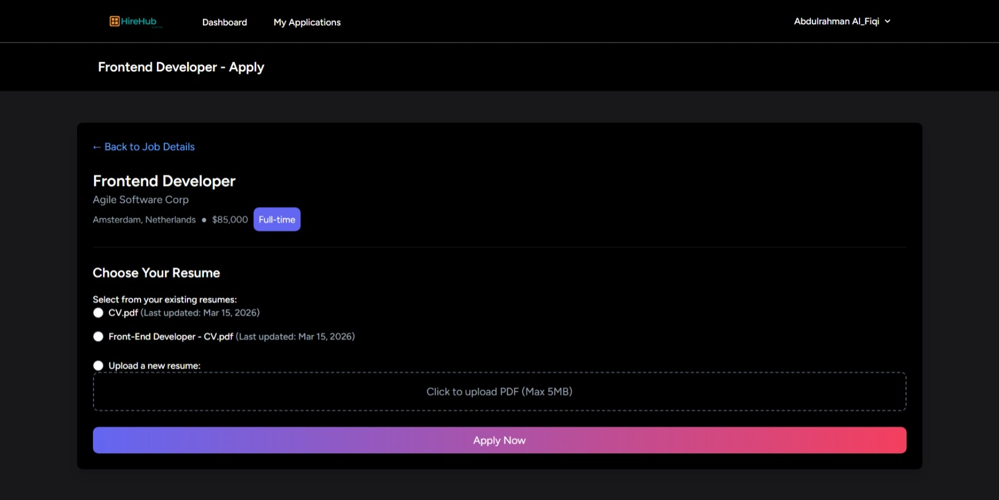

#### My Applications (with AI Feedback & Score)
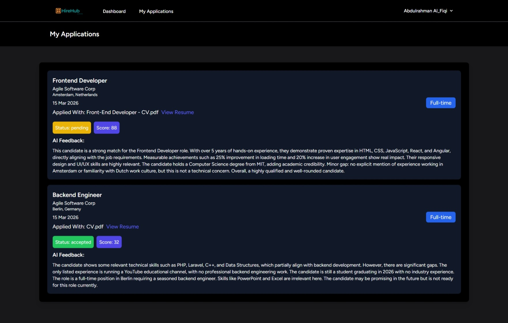

---

### Backoffice

#### Login
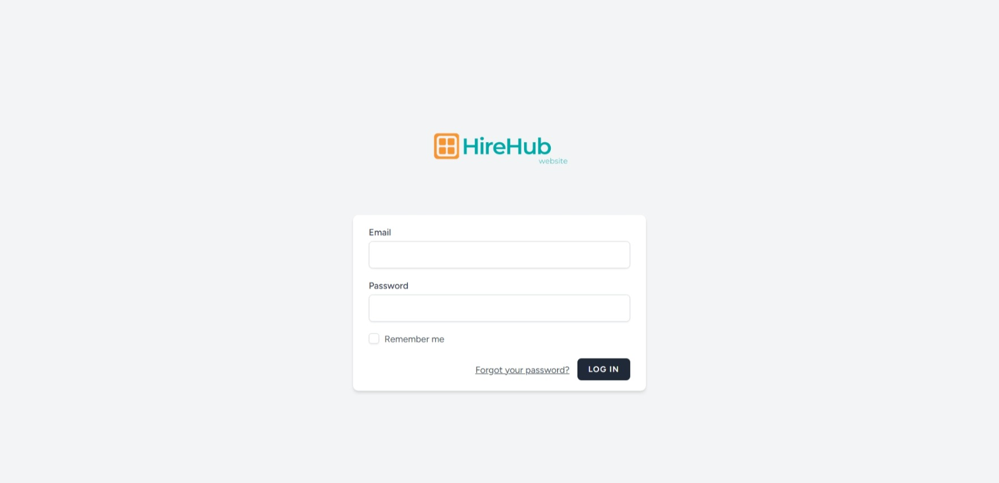

#### Admin Dashboard
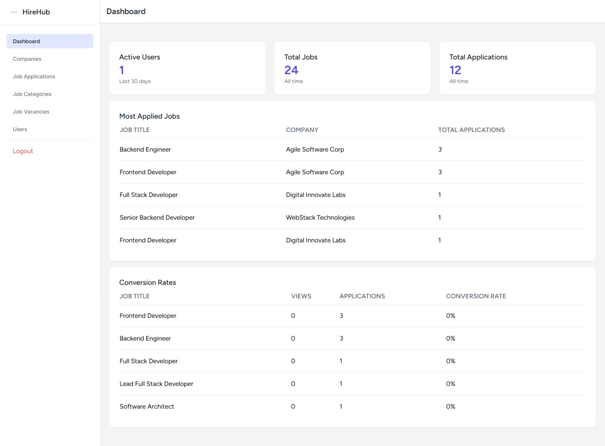

#### Companies
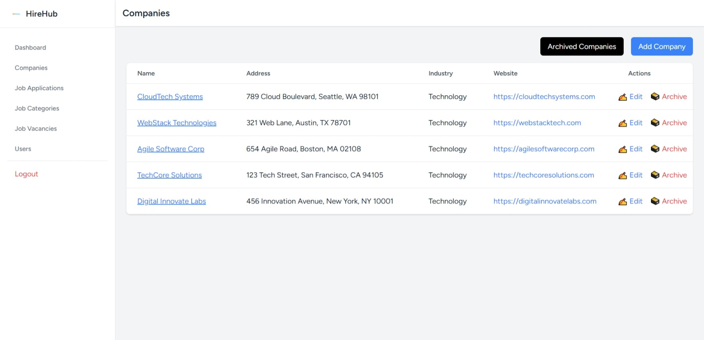

#### Job Applications
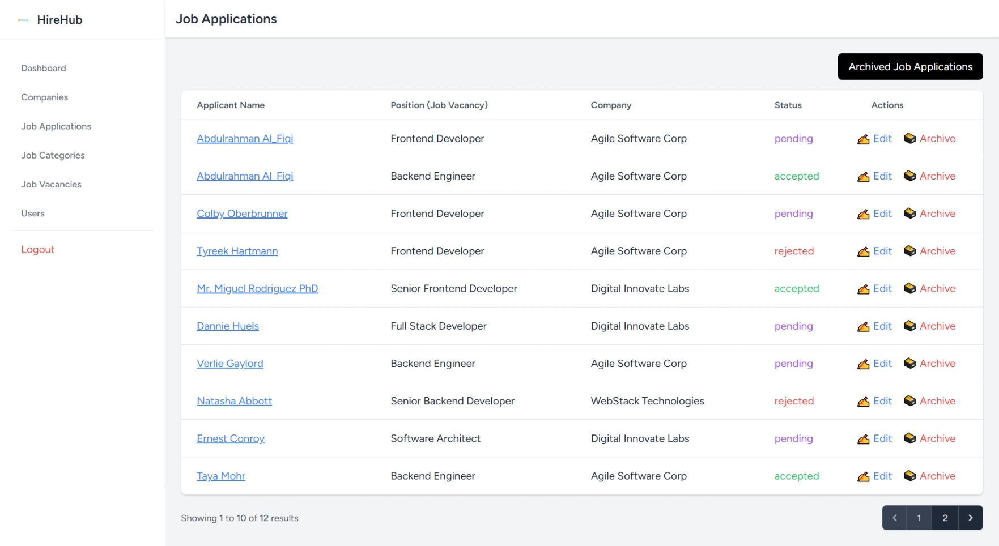

#### Job Categories
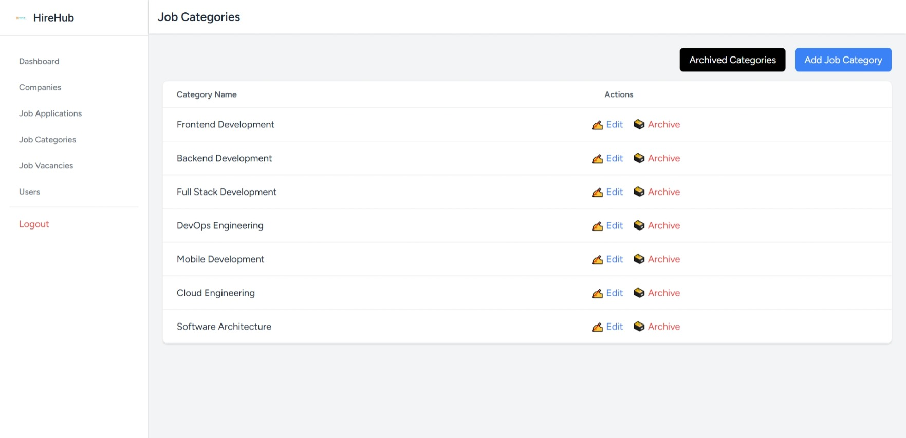

#### Job Vacancies
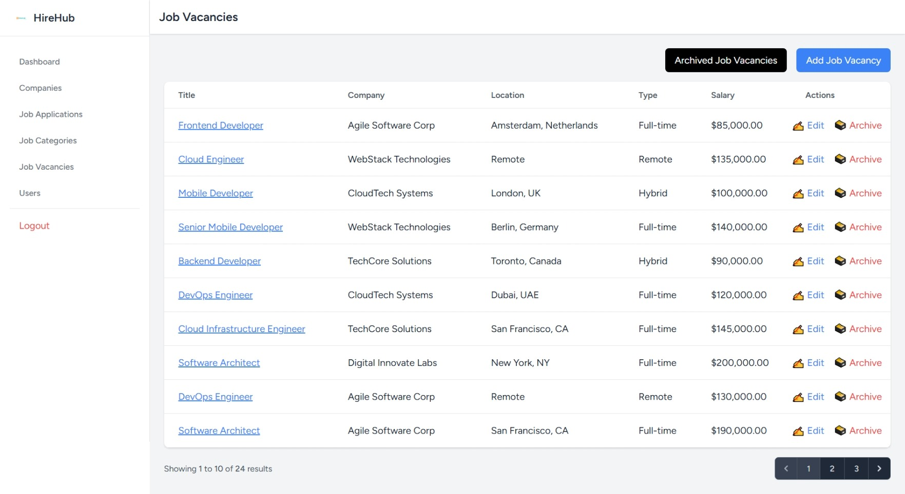

---

## Tech Stack

| Layer | Technology |
|-------|-----------|
| Backend | Laravel 12, PHP 8.2 |
| Frontend | Blade Templates, Tailwind CSS |
| Database | PostgreSQL (Neon — production), SQLite (local dev) |
| File Storage | Laravel Cloud Bucket (Cloudflare R2) |
| AI | Anthropic Claude API (resume parsing & scoring) |
| PDF Parsing | Spatie PDF-to-Text + pdftotext |
| Deployment | Laravel Cloud |
| Shared Package | Custom Composer package (`job/shared`) via GitHub VCS |

---

## Architecture

```
Job-Board-Website/
├── job-app/              # Job seeker Laravel app
├── job-backoffice/       # Admin backoffice Laravel app
│   └── database/
│       └── migrations/   # All shared migrations live here
└── job-shared/           # Composer package with shared models
    └── src/
        └── Models/
            ├── User.php
            ├── Company.php
            ├── JobVacancy.php
            ├── JobApplication.php
            ├── JobCategory.php
            └── Resume.php
```

Both apps share the same database and the same Eloquent models via the `job/shared` composer package.

---

## Local Development Setup

### Prerequisites
- PHP 8.2+
- Composer
- SQLite

### 1. Clone the repositories

```bash
git clone https://github.com/Abdulrahman1Fiqi/Job-Board-Website.git
cd Job-Board-Website
```

### 2. Install dependencies for both apps

```bash
cd job-app && composer install && cp .env.example .env && php artisan key:generate
cd ../job-backoffice && composer install && cp .env.example .env && php artisan key:generate
```

### 3. Create the shared SQLite database

```bash
mkdir -p database
touch database/shared.sqlite
```

### 4. Configure `.env` in both apps

```env
DB_CONNECTION=sqlite
DB_DATABASE=/absolute/path/to/Job-Board-Website/database/shared.sqlite
```

### 5. Run migrations (from job-backoffice only)

```bash
cd job-backoffice
php artisan migrate --seed
```

### 6. Start both apps

```bash
# Terminal 1
cd job-backoffice && php artisan serve --port=8001

# Terminal 2
cd job-app && php artisan serve --port=8000
```

---

## Environment Variables

### Required for both apps

```env
APP_KEY=
DB_CONNECTION=pgsql
DB_HOST=
DB_PORT=5432
DB_DATABASE=
DB_USERNAME=
DB_PASSWORD=
DB_SSLMODE=require
```

### Required for job-app only

```env
CLAUDE_API_KEY=        # Anthropic Claude API key
FILESYSTEM_DISK=cloud
LARAVEL_CLOUD_BUCKET=
LARAVEL_CLOUD_DEFAULT_REGION=auto
LARAVEL_CLOUD_ENDPOINT=
LARAVEL_CLOUD_URL=
LARAVEL_CLOUD_ACCESS_KEY_ID=
LARAVEL_CLOUD_SECRET_ACCESS_KEY=
LARAVEL_CLOUD_USE_PATH_STYLE_ENDPOINT=false
```

---

## Deployment (Laravel Cloud)

1. Push all three repos to GitHub
2. Create two apps on [Laravel Cloud](https://cloud.laravel.com) — one for `job-app`, one for `job-backoffice`
3. Set environment variables in each app's **Settings → General → Custom environment variables**
4. Run migrations from `job-backoffice` Commands tab:
   ```bash
   php artisan migrate --force
   ```
5. Redeploy both apps

---

## User Roles

| Role | Access |
|------|--------|
| `admin` | Full access to backoffice — all companies, jobs, users, applications |
| `company-owner` | Backoffice access limited to their own company data |
| `job-seeker` | Job app only — browse jobs, apply, view applications |

---

## AI Resume Analysis

When a job seeker applies, HireHub uses the **Claude API** to:

1. Extract text from the uploaded PDF resume using `pdftotext`
2. Parse the resume into structured JSON (summary, skills, experience, education)
3. Score the candidate's fit for the job (0–100)
4. Generate concise, plain-text feedback specific to the job and candidate

---

## Author

**Abdulrahman Al-Fiqi**

---

## License

This project is open-sourced under the [MIT license](LICENSE).
